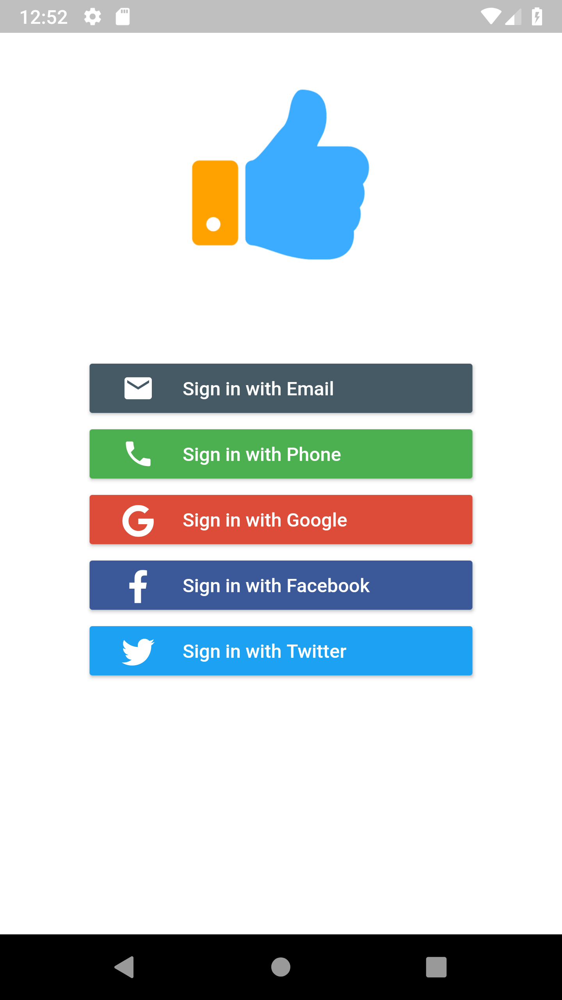
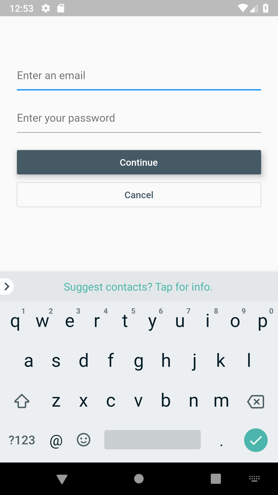
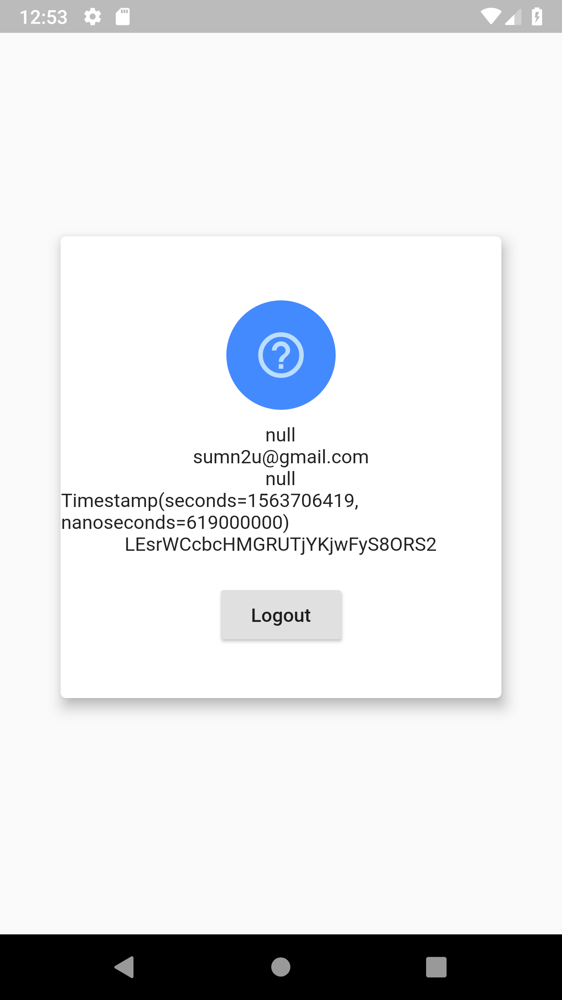
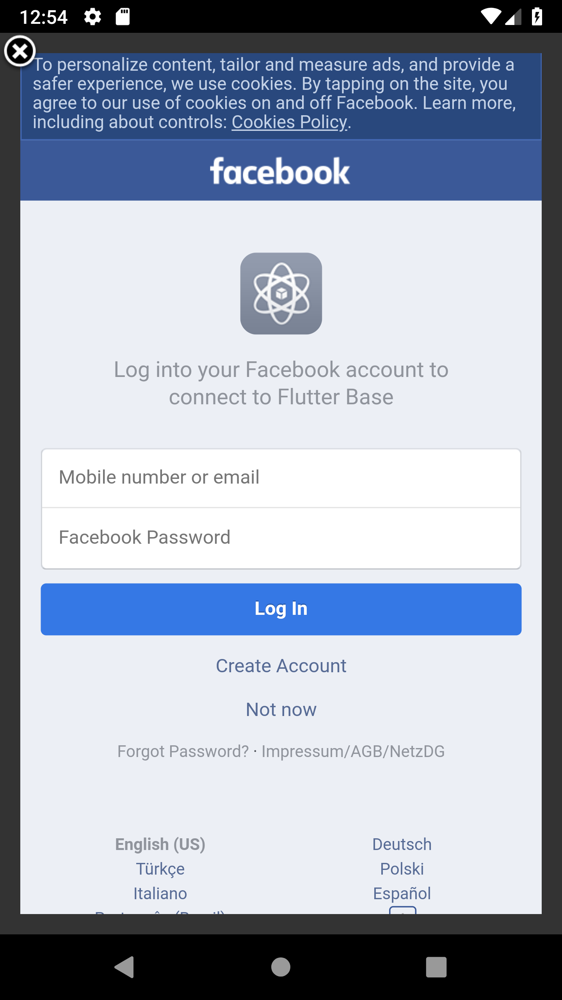

# Flutter-Firebase

An open-source flutter project which includes different authentication mechanism provided by firebase.

This project is integrated with Firebase for user authentication and contains all the basic features that are required to build an amazing Flutter app. 

# Demo

### Screenshots

 

# Features
* Form Validation
* Firebase Authentication
    
## Getting Started
**Note:** Make sure your Flutter environment is [setup](https://flutter.io/getting-started/).

#### Installation

In the command terminal, run the following commands:

    $ git clone git@github.com:GeekyAnts/FlatApp-Firebase-Flutter.git
    $ cd FlatApp-Firebase-Flutter/
    

##### For Android
In `android/app` folder add your `google-service.json`.
##### For iOS
In `ios/Runner` folder add your `GoogleService-Info.plist`.

##### Start your Flutter project by running the command:
    $ flutter run

# Simulate for iOS
#### Method One
    
    Open the project in Xcode from ios/Runner.xcodeproj.
    Hit the play button.

#### Method Two

    Run the following command in your terminal.
    $ open -a Simulator
    $ flutter run

# Simulate for Android

    Make sure you have an Android emulator installed and running.
    Run the following command in your terminal.
    $ flutter run
    
##### Check out Flutter’s online [documentation](http://flutter.io/) for help getting start with your Flutter project. 

